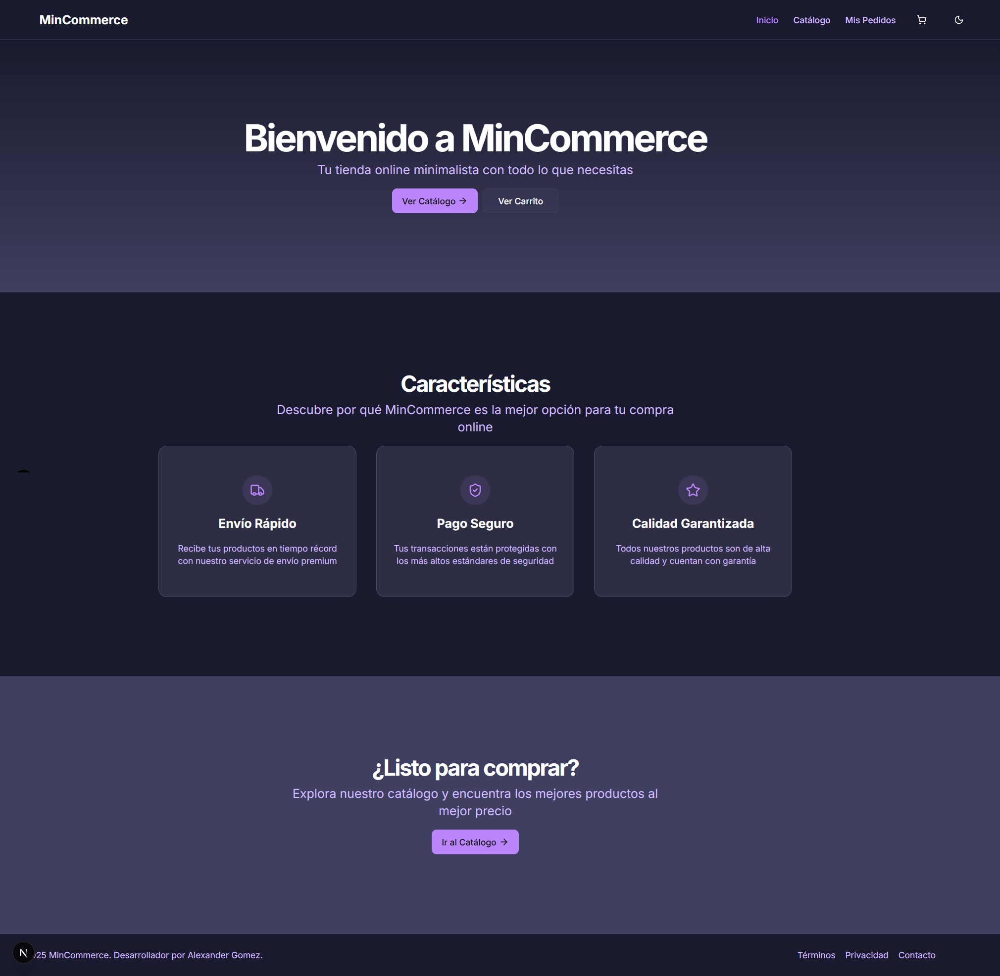
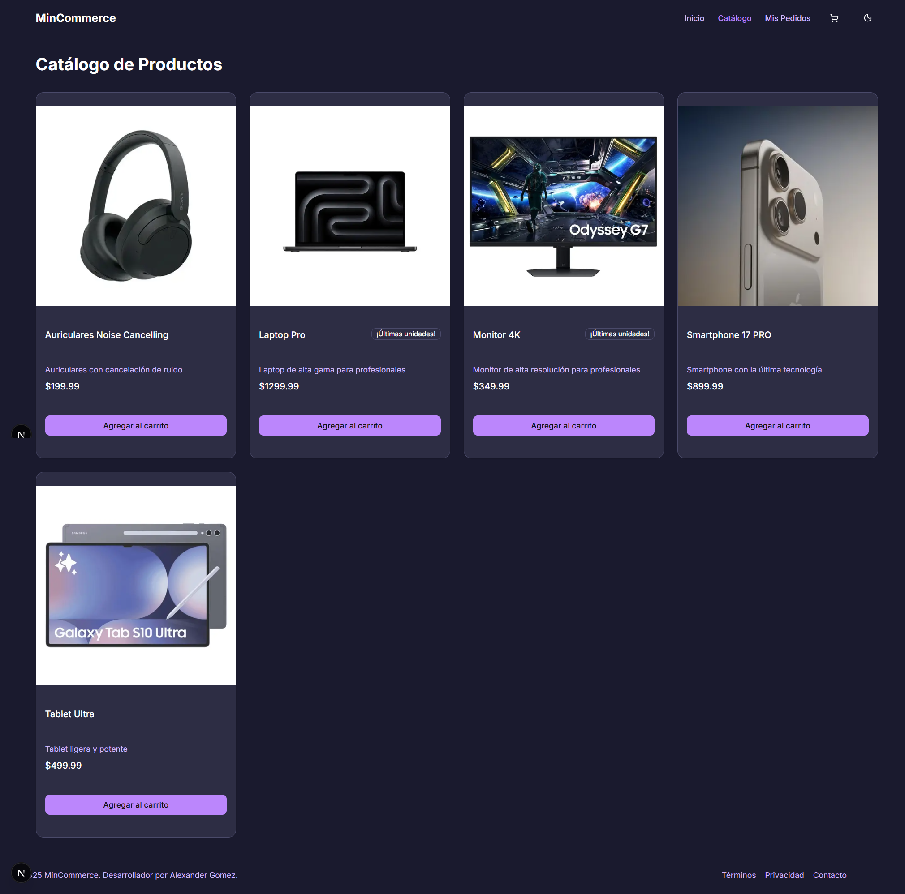
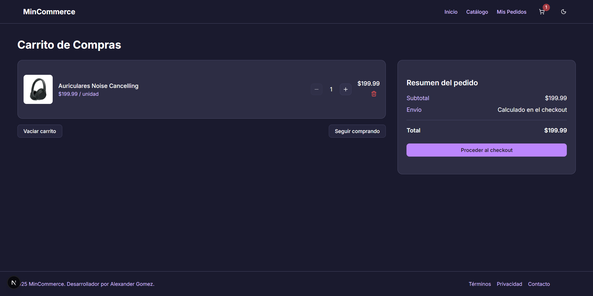
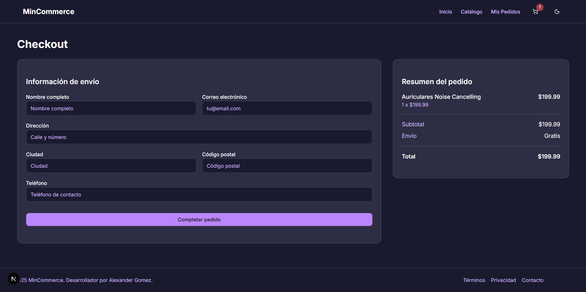
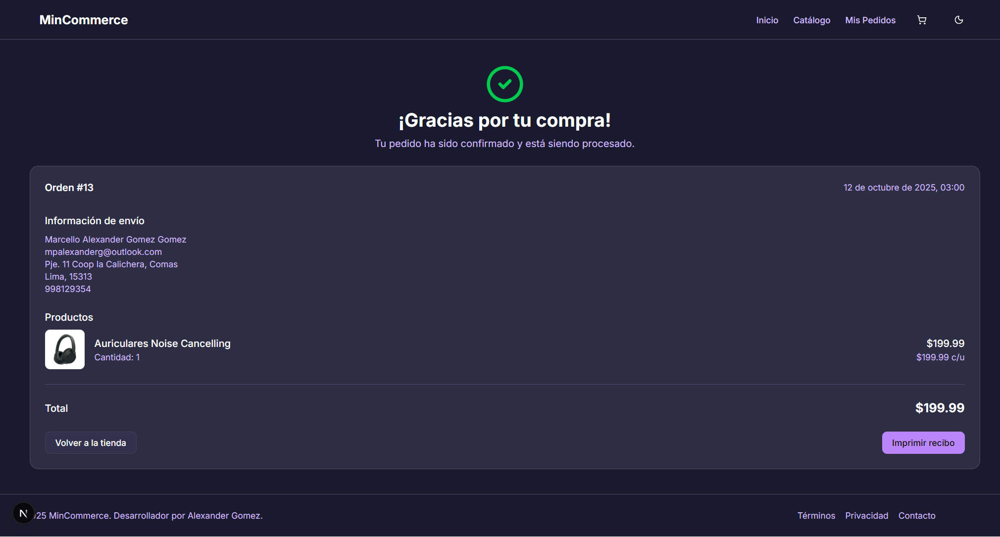
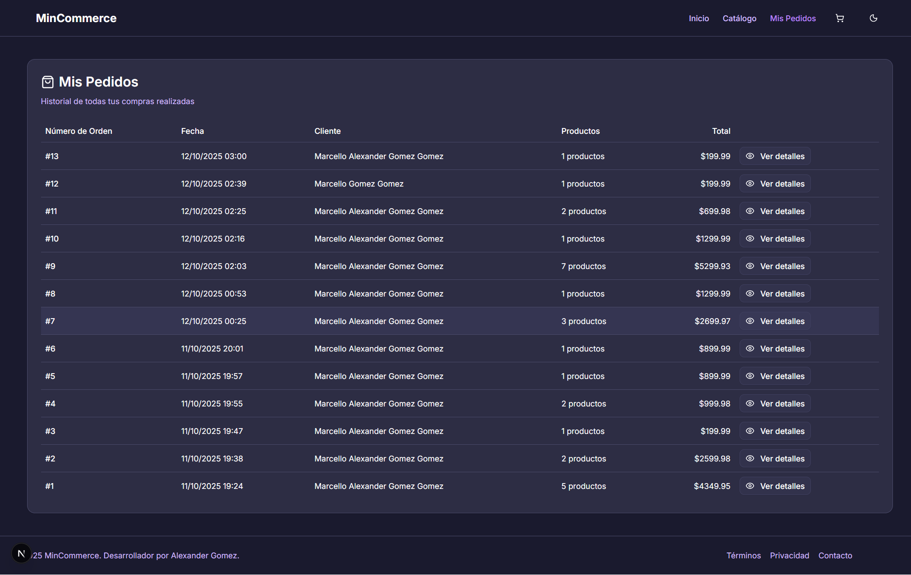

# MinCommerce - Tienda Minimalista con Next.js








## 📋 Descripción del Proyecto

MinCommerce es una aplicación de comercio electrónico minimalista desarrollada como proyecto de aprendizaje utilizando las tecnologías más modernas del ecosistema React. Esta plataforma implementa todas las funcionalidades esenciales de un e-commerce, con un diseño limpio y una experiencia de usuario fluida.

El proyecto fue creado para profundizar mis conocimientos en Next.js, React y TypeScript, aplicando conceptos avanzados como Server Components, Client Components, manejo de estado global, y optimización de rendimiento.

### ✨ Características Principales

- **Catálogo de Productos**: Visualización de productos con imágenes, descripciones y precios
- **Carrito de Compras**: Gestión completa con persistencia de datos usando Zustand
- **Proceso de Checkout**: Flujo de compra intuitivo con validación de formularios
- **Gestión de Pedidos**: Visualización y seguimiento de pedidos realizados
- **Tema Claro/Oscuro**: Sistema de temas personalizable con colores adaptados
- **Notificaciones Toast**: Feedback visual para acciones del usuario
- **Diseño Responsivo**: Experiencia optimizada para dispositivos móviles y escritorio

## 🛠️ Tecnologías Utilizadas

### Frontend
- **Next.js 15**: Framework React con renderizado híbrido (SSR/CSR)
- **React 19**: Biblioteca para construcción de interfaces
- **TypeScript**: Tipado estático para desarrollo más robusto
- **Tailwind CSS**: Framework de utilidades CSS para diseño rápido
- **Zustand**: Gestión de estado global minimalista
- **React Hook Form**: Manejo de formularios con validación
- **Zod**: Validación de esquemas con TypeScript
- **Sonner**: Sistema de notificaciones toast
- **Next Themes**: Gestión de temas claro/oscuro
- **Lucide React**: Iconos SVG modernos
- **date-fns**: Utilidades para manejo de fechas

### Backend
- **Prisma ORM**: ORM para interacción con base de datos
- **API Routes de Next.js**: Endpoints para operaciones CRUD

## 🚀 Instalación y Uso

### Requisitos Previos
- Node.js (versión 18 o superior)
- npm o yarn

### Pasos de Instalación

1. **Clonar el repositorio**
   ```bash
   git clone https://github.com/tu-usuario/min-commerce-nextjs.git
   cd min-commerce-nextjs
   ```

2. **Instalar dependencias**
   ```bash
   npm install
   # o
   yarn install
   ```

3. **Configurar variables de entorno**
   ```bash
   # Crear archivo .env.local basado en .env.example
   cp .env.example .env.local
   # Editar .env.local con tus configuraciones
   ```

4. **Inicializar la base de datos**
   ```bash
   npx prisma migrate dev
   npm run seed
   ```

5. **Iniciar el servidor de desarrollo**
   ```bash
   npm run dev
   # o
   yarn dev
   ```

6. **Acceder a la aplicación**
   Abre [http://localhost:3000](http://localhost:3000) en tu navegador

## 📁 Estructura del Proyecto

```
min-commerce-nextjs/
├── app/                    # Rutas y páginas de Next.js App Router
│   ├── api/                # API Routes para operaciones del backend
│   │   ├── orders/         # Endpoints para gestión de pedidos
│   │   └── products/       # Endpoints para gestión de productos
│   ├── cart/               # Página del carrito de compras
│   ├── catalog/            # Página de catálogo de productos
│   ├── checkout/           # Flujo de proceso de compra
│   ├── order/              # Páginas de gestión de pedidos
│   │   └── confirmation/   # Confirmación de pedidos
│   ├── product/            # Página de detalle de producto
│   ├── globals.css         # Estilos globales y variables CSS
│   └── layout.tsx          # Layout principal de la aplicación
├── components/             # Componentes reutilizables
│   ├── ui/                 # Componentes de UI básicos
│   ├── add-to-cart-button.tsx  # Botón de añadir al carrito
│   ├── navbar.tsx          # Barra de navegación
│   ├── product-card.tsx    # Tarjeta de producto
│   ├── theme-provider.tsx  # Proveedor de temas
│   └── theme-toggle.tsx    # Botón de cambio de tema
├── lib/                    # Utilidades y lógica de negocio
│   ├── prisma.ts           # Cliente de Prisma
│   ├── store/              # Estado global con Zustand
│   ├── utils.ts            # Funciones de utilidad
│   └── validation/         # Esquemas de validación con Zod
├── prisma/                 # Configuración de Prisma ORM
│   ├── migrations/         # Migraciones de base de datos
│   ├── schema.prisma       # Esquema de la base de datos
│   └── seed.js             # Script para poblar la base de datos
├── public/                 # Archivos estáticos
├── tailwind.config.js      # Configuración de Tailwind CSS
└── tsconfig.json           # Configuración de TypeScript
```

## 📦 Dependencias Principales

### Producción
```bash
# Core
npm install next@15.5.4 react@19.1.0 react-dom@19.1.0 typescript@5

# UI y Estilos
npm install tailwindcss@4 tailwindcss-animate class-variance-authority clsx tailwind-merge
npm install lucide-react @radix-ui/react-dialog @radix-ui/react-label @radix-ui/react-separator @radix-ui/react-slot

# Estado y Formularios
npm install zustand@5.0.8 react-hook-form@7.65.0 @hookform/resolvers@5.2.2 zod@4.1.12

# Base de Datos
npm install @prisma/client@6.17.0 prisma@6.17.0

# Utilidades
npm install date-fns@4.1.0 sonner@2.0.7 next-themes@0.4.6
```

### Desarrollo
```bash
npm install -D @types/node@20 @types/react@19 @types/react-dom@19 eslint@9 eslint-config-next@15.5.4 ts-node@10.9.2
```

## 🌐 Despliegue

El proyecto está configurado para ser desplegado en plataformas como Vercel o Netlify. Para desplegar en Vercel:

```bash
# Instalar Vercel CLI
npm install -g vercel

# Desplegar
vercel
```

## 🎨 Personalización

El proyecto utiliza una paleta de colores personalizada basada en tonos morados y rosas, que puede ser modificada en:

- `app/globals.css`: Variables CSS para temas claro y oscuro
- `tailwind.config.js`: Configuración de colores de Tailwind

## 👤 Autor

Desarrollado por [Alexander Gomez](https://linksxander.netlify.app/)

- LinkedIn: [Marcello Alexander Gomez Gomez](https://www.linkedin.com/in/marcello-alexander-gomez-gomez-130587268/)
- GitHub: [@AlexanderG8](https://github.com/AlexanderG8)

---

<p align="center">
  <sub>Construido con ☕ & 💙 usando Next.js y React</sub>
</p>